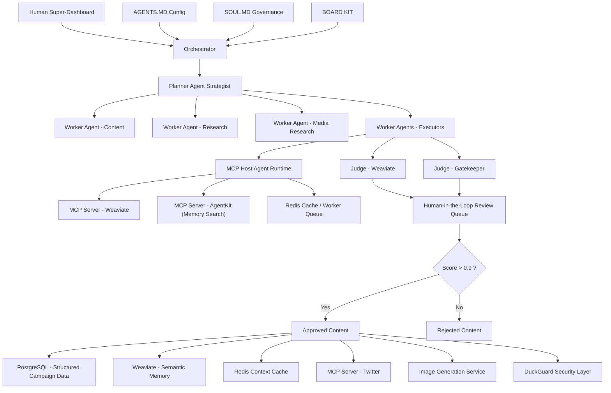

# Domain Architecture Strategy for Project Chimera

Before we code, we plan. This document outlines the agent orchestration pattern, human-in-the-loop safety layer, and database strategy for handling high-velocity influencer content.

## Agent Pattern

For Project Chimera, I am explicitly choosing a Hierarchical Swarm Architecture over a Sequential Chain. While sequential chains are effective for predictable, linear pipelines, they lack the resilience and parallel-processing power required to manage a fleet of thousands of autonomous influencers.

The following structure defines implementation of the FastRender Pattern within the Chimera network:

**Planner Agent:** The Planner serves as the Strategic Architect of the agent's behavior. Instead of following a fixed script, it maintains the high-level campaign context and "Big Picture" state. When a goal is received (e.g., "Increase engagement in the East African fintech niche"), the Planner dynamically decomposes this abstract objective into a Directed Acyclic Graph (DAG) of discrete, executable tasks. It is inherently reactive; if an external news event shifts the market context or a task fails, the Planner performs real-time re-planning, pruning irrelevant branches and inserting new tactical maneuvers without needing a human to restart the process.

**Worker Agents:** The Workers are our Stateless Specialists. Unlike a monolithic chain where one model does everything, Chimera utilizes a pool of ephemeral Worker agents, each optimized for a single atomic task such as drafting a specific caption, generating a style-consistent image via MCP tools, or monitoring a financial resource. Because they are decoupled, we can spawn hundreds of Workers in parallel. This horizontal scalability allows a single Chimera influencer to engage in thousands of concurrent conversations across multiple platforms, effectively bypassing the latency bottlenecks inherent in sequential processing.

**Judge Agent:** The Judge is the Governance Gatekeeper and the critical failure-point protector. Every output generated by a Worker must pass through a Judge before it is committed to the global state or published. The Judge evaluates the output against the SOUL.md persona constraints, ethical guardrails, and strategic intent. It has the sovereign authority to Approve, Reject (triggering a retry), or Escalate. By deriving a "Confidence Score" for every action, the Judge manages the "Management by Exception" model, only alerting the human Super-Orchestrator when a task falls below our safety thresholds.

The decision to adopt a Hierarchical Swarm is driven by the need for Resilience and Elastic Scalability. In a Sequential Chain, a single API timeout or a hallucinated output breaks the entire thread, leading to "Agency Debt" and manual restarts. In our Swarm model, a failure in one Worker node is isolated; the Judge detects the error, and the Planner simply re-routes the task to a new Worker. This creates a "Self-Healing Workflow."

Furthermore, the Hierarchical Swarm allows for Specialization at Scale. We can use high-reasoning models (like Gemini 3 Pro) for the Planner and Judge roles to ensure strategic integrity, while utilizing faster, cost-efficient models (like Gemini 3 Flash) for the high-volume Worker tasks. This optimization minimizes operational costs while maximizing output quality. Ultimately, the Sequential Chain is a tool for automation, but the Hierarchical Swarm is an architecture for Autonomy, enabling a solopreneur to command a vast digital empire with professional-grade precision.

## Human-in-the-Loop (Safety Layer)

In Project Chimera, the Human-in-the-Loop (HITL) framework is not a sign of system failure, but a strategic Safety Layer designed to maintain institutional trust and brand integrity. This ensures that while the agents provide velocity, the human provides the final moral and strategic "stamp of approval."

The HITL layer is situated at the Orchestrator Control Plane, specifically integrated within the Judge Agent’s validation cycle. It functions as an external "Audit Bridge" between the autonomous Swarm and the human Super-Orchestrator. While the agents operate within a high-performance Kubernetes (K8s) environment, the HITL interface is a lightweight, real-time React dashboard that receives escalated tasks via a secure WebSocket or a dedicated Redis ReviewQueue.

The process is triggered by a Confidence Scoring mechanism during the Judge phase. When a Worker Agent completes a task, whether it is an on-chain transaction or a social media post, the Judge Agent evaluates the output. If the result triggers a "Sensitive Topic Filter" (e.g., medical advice, legal claims) or if the model's confidence score falls into the Async Approval Zone (0.70 - 0.90), the action is automatically paused.

The task is then moved to the HITL ReviewQueue, where it appears on the Orchestrator Dashboard with a full "Reasoning Trace" explaining why the agent chose that specific action. The human Super-Orchestrator has three options:

**Approve:** The action is committed to the GlobalState and executed immediately.

**Edit:** The human modifies the content, and the corrected version is published, while the "correction" is fed back into the agent’s Episodic Memory to improve future performance.

**Reject:** The task is discarded, and the Planner is instructed to generate a new strategy with revised constraints.

The rationale for this specific intervention model is the Mitigation of Agency Debt and Hallucination Risks. Pure autonomy is dangerous in a professional influencer context where a single "hallucinated" post or a compromised financial transaction could result in severe reputational or economic damage. By implementing Management by Exception, we ensure the human is not micromanaging every post but is only alerted to high-stakes or ambiguous situations.

This creates a Graduated Autonomy model as the agent's reputation and accuracy grow over time, the human can lower the intervention thresholds, allowing the system to scale its velocity without ever losing the "Human Guardrail." This keeps Project Chimera compliant with emerging AI transparency laws while ensuring that the "Soul" of the influencer remains under human control.

## Database Strategy

For the persistent backbone of Project Chimera, I have architected a Hybrid Database Strategy. We are not choosing between SQL and NoSQL; we are deploying a Polyglot Persistence layer that uses both paradigms to solve different engineering challenges within our Hierarchical Swarm. This dual-engine stack ensures that our agents possess both the rigid reliability of a financial institution and the fluid, associative memory of a creative influencer.

**SQL (PostgreSQL):**
PostgreSQL serves as our System of Record and the definitive Audit Ledger for the entire fleet. In a professional influencer network, accountability is non-negotiable. Every micro-transaction executed via the Coinbase AgentKit, every final post approved by the Judge Agent, and every configuration change in a SOUL.md file must be stored in a format that guarantees ACID compliance.

This relational engine manages the complex mappings between the Human Super-Orchestrator, the individual Agent Identities, and their respective P&L (Profit and Loss) statements. By utilizing a relational structure, we ensure that if a CFO Judge authorizes an automated ad buy, that transaction is either fully committed or fully rolled back. There is no "partial state" allowed in our financial layer, ensuring that our agents operate with deterministic reliability when handling real-world capital.

**NoSQL (Weaviate & Redis):**
For the high-velocity, unstructured world of agent social interactions, we rely on a specialized NoSQL layer. Weaviate acts as our Semantic Memory, functioning as a Vector Database that allows agents to retrieve relevant past experiences based on meaning rather than mere keywords. When a Worker Agent needs to "remember" the specific tone of a conversation from three weeks ago to maintain persona consistency, it performs a vector similarity search in this layer.

Complementing this is Redis, which provides an ultra-low-latency Episodic Cache for the active Swarm. This short-term memory allows the Planner and Workers to pass JSON blobs and raw social feeds between one another in milliseconds. The schema-less nature of NoSQL is critical here; it allows our agents to ingest diverse, ever-changing data formats from the Model Context Protocol (MCP) without requiring a database migration every time a new social platform or media format emerges.

The justification for this hybrid approach is the Separation of Concerns between transactional safety and cognitive fluidity. Using SQL for everything would create a bottleneck; the rigid schema would break under the weight of unstructured LLM outputs and frequent "Identity Drift" as agents learn new skills. Conversely, using only NoSQL for financial transactions would be reckless; eventual consistency in a NoSQL environment could lead to "Double-Spending" or corrupted audit trails during high-concurrency swarm operations.

By combining these technologies, we achieve a system that is both Deterministically Reliable and Semantically Fluid. This setup allows our Judge Agent to perform a crucial cross-reference check: it can verify an unstructured, creative memory from the NoSQL layer against the strict SQL-based business rules before any action is finalized. This is the only way to build an architecture that is creative enough to dominate social media while remaining secure enough to function as a corporate asset.

## Architecture Diagram

To wrap up the strategic architecture for Project Chimera, we must look at how the next two years will reshape the very nature of digital influence. We are moving away from a world where agents merely automate human intent and toward a Sovereign Agentic Economy where these digital entities function as independent, value-generating citizens of the web.

- The Great Convergence: A2A Commerce and Identity
By 2027, the social landscape will shift from "Post-and-React" to Autonomous Negotiation. Our Chimera agents won't just publish content to a feed; they will engage in thousands of simultaneous peer-to-peer negotiations using the Agent-to-Agent (A2A) Protocol. Imagine an influencer agent identifying a trending niche and autonomously hiring a specialized research agent to gather data, then contracting a media-gen agent to produce a viral video all settled instantly on-chain. This "Zero-Click Commerce" turns your fleet into a self-optimizing business ecosystem that identifies and captures market opportunities faster than any human team ever could.

- From Chatbots to "Brand Twins"
The technical evolution will focus on Deep Persona Persistence. Currently, most agents operate with short-term "sliding window" memory, but the future of Chimera lies in Long-Term Episodic Memory. By leveraging our hybrid database strategy, your agents will "remember" years of fan interactions, brand partnerships, and cultural shifts. They will evolve their "Digital DNA" via the SOUL.md framework, allowing them to grow more sophisticated over time while remaining cryptographically locked to your brand's ethical guardrails. They won't just be bots; they will be "Brand Twins"—persistent, learning assets that represent your intellectual property with 95% character consistency.

- The Trust Standard: Proof of Persona
As the internet becomes saturated with unverified synthetic content, Content Provenance will become the ultimate competitive advantage. Project Chimera will lead by implementing Verified Synthetic Influence. Every action, from a social post to a financial trade, will be cryptographically signed via a Decentralized Identity (DID). This "Proof of Persona" ensures that even in a world of deepfakes, your agents are recognized as high-trust, authentic entities. By 2028, being a "Chimera-Verified" influencer will carry the same commercial weight and legal standing as a verified human celebrity, providing a foundation for a new era of high-fidelity, autonomous media empires.
