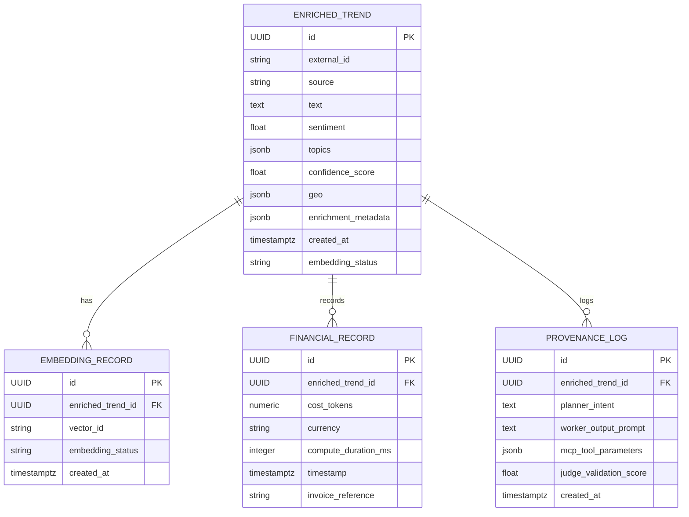

# Data Model: Trend Ingestion Pipeline

## Mermaid ERD (visual)

## Entities

### EnrichedTrend
- id: uuid (PK)
- external_id: string (indexed)
- source: string
- text: text
- sentiment: float
- topics: jsonb
- confidence_score: float
- geo: jsonb nullable
- enrichment_metadata: jsonb
- created_at: timestamptz
- embedding_status: enum {pending, succeeded, failed}

### EmbeddingRecord
- id: uuid (PK)
- enriched_trend_id: uuid (FK -> EnrichedTrend.id)
- vector_id: string
- embedding_status: enum {pending, succeeded, failed}
- created_at: timestamptz

### FinancialRecord
- id: uuid (PK)
- enriched_trend_id: uuid (FK -> EnrichedTrend.id)
- cost_tokens: numeric
- currency: string
- compute_duration_ms: integer
- timestamp: timestamptz
- invoice_reference: string nullable

### Provenance / GenerationLog
- id: uuid (PK)
- enriched_trend_id: uuid (FK)
- planner_intent: text
- worker_output_prompt: text
- mcp_tool_parameters: jsonb
- judge_validation_score: float
- created_at: timestamptz

## Indexes & Constraints
- Unique constraint on (external_id, source)
- Index on created_at for retention queries
- FK constraints between EnrichedTrend -> EmbeddingRecord and FinancialRecord

## Notes
- FinancialRecord writes must be durable and auditable; consider WAL archiving and read replicas for reporting.
- EmbeddingRecord may be written after EnrichedTrend; ensure idempotent upserts for retries.
