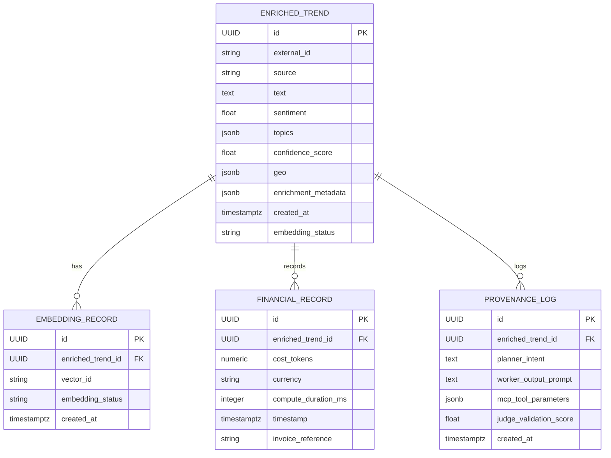
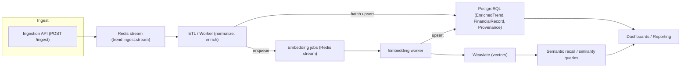

# Data Model: Trend Ingestion Pipeline

## Mermaid ERD (visual)



## Entities

### EnrichedTrend
- id: uuid (PK)
- external_id: string (indexed)
- source: string
- text: text
- sentiment: float
- topics: jsonb
- confidence_score: float
- geo: jsonb nullable
- enrichment_metadata: jsonb
- created_at: timestamptz
- embedding_status: enum {pending, succeeded, failed}

### EmbeddingRecord
- id: uuid (PK)
- enriched_trend_id: uuid (FK -> EnrichedTrend.id)
- vector_id: string
- embedding_status: enum {pending, succeeded, failed}
- created_at: timestamptz

### FinancialRecord
- id: uuid (PK)
- enriched_trend_id: uuid (FK -> EnrichedTrend.id)
- cost_tokens: numeric
- currency: string
- compute_duration_ms: integer
- timestamp: timestamptz
- invoice_reference: string nullable

### Provenance / GenerationLog
- id: uuid (PK)
- enriched_trend_id: uuid (FK)
- planner_intent: text
- worker_output_prompt: text
- mcp_tool_parameters: jsonb
- judge_validation_score: float
- created_at: timestamptz

## Indexes & Constraints
- Unique constraint on (external_id, source)
- Index on created_at for retention queries
- FK constraints between EnrichedTrend -> EmbeddingRecord and FinancialRecord

## Notes
- FinancialRecord writes must be durable and auditable; consider WAL archiving and read replicas for reporting.
- EmbeddingRecord may be written after EnrichedTrend; ensure idempotent upserts for retries.

## Data Lifecycle & Migration Strategy

### Overview
This section defines the data lifecycle for trend ingestion and a concrete, implementable migration strategy. The lifecycle describes how data moves through Redis (high-velocity buffer), PostgreSQL (system-of-record), and Weaviate (semantic vectors). The migration strategy uses Alembic for schema versioning and prescribes forward/backward migrations, rollback, seeding, and audit logging patterns. The operational patterns below are intentionally prescriptive so an autonomous agent can perform DB setup, migrations, and runtime buffering with deterministic behavior.

### Lifecycle Flow (high-level)
1. Ingestion API receives incoming trend payloads (`POST /ingest`).
2. API performs lightweight validation and atomically writes a serialized message into Redis (use Redis Streams or LIST with a configurable key `trend:ingest:stream`). Include `external_id`, `source`, `payload`, and `received_at`.
3. ETL/worker consumers (one or more) read the Redis stream in consumer groups, validate/normalize the payload, perform enrichment (NLP/sentiment), and buffer updates.
4. Workers perform idempotent upserts into PostgreSQL (`EnrichedTrend`, `FinancialRecord`, `ProvenanceLog`) in batches.
5. After persisting the base record, the worker emits embedding requests to the embedding service and stores vector references in `EmbeddingRecord`; embeddings are persisted in Weaviate (or the configured vector store) and the `embedding_status` is updated in PostgreSQL.
6. Dashboards and semantic recall query PostgreSQL for structured data and Weaviate for semantic similarity searches.

### Detailed runtime pattern (Redis → PostgreSQL → Weaviate)
- Redis buffer: use Redis Streams with consumer groups (XADD/XREADGROUP) to enable at-least-once delivery and scalable consumers. Message payloads should include `msg_id`, `external_id`, `source`, `payload`, `received_at`, and `attempts`.
- Consumer semantics: Consumers claim pending entries (XPENDING/XCLAIM) and process messages using idempotent semantics (unique constraint on `(external_id, source)` in PostgreSQL plus upsert logic). On success, acknowledge the stream entry (XACK). On repeated failures, route to a dead-letter list `trend:ingest:dlq` with diagnostic info.
- Batch flush: accumulate normalized records in memory up to `BATCH_SIZE` or `BATCH_WINDOW_MS` then write in a single transaction to PostgreSQL using `INSERT ... ON CONFLICT (external_id, source) DO UPDATE SET ...` to ensure idempotency.
- Embedding enrichment: after committing PostgreSQL, enqueue embedding jobs (e.g., a separate Redis stream `trend:embedding:jobs`) that the embedding worker consumes, sends to model, stores resulting vector in Weaviate, and upserts `EmbeddingRecord` with `vector_id` and `embedding_status`.

### High-velocity metadata handling & OCC
- Use optimistic concurrency control (OCC) on mutable rows. Add a `version` integer column with default 0 to tables that are updated frequently (e.g., `EnrichedTrend.version`). Update statements must include `WHERE id = :id AND version = :expected_version` and increment `version = version + 1` on success. If no rows are affected, treat as a concurrency conflict and retry a bounded number of times.
- Alternatively, use a `last_updated_at` timestamp with a comparable `WHERE last_updated_at = :expected_ts` pattern if version integers are not preferred.
- For financial writes (e.g., `FinancialRecord`), use explicit transactional writes and append-only ledger entries to ensure auditability; do not overwrite existing financial rows.

### Migration Strategy (Alembic)
- Repository layout: maintain Alembic revisions under `src/migrations/versions` (or `alembic/versions`). Keep `alembic.ini` configured to read DB URLs from `DATABASE_URL` env var.

- Creating migrations:
  - Use `alembic revision --autogenerate -m "describe change"` to scaffold migrations. Review autogenerated SQL carefully and edit if data migrations are required.
  - For non-trivial schema changes that require data transformation, create two-step migrations: (a) add nullable columns and background backfill; (b) make columns non-nullable and add constraints.

- Forward / backward migrations:
  - Each revision MUST include an explicit `upgrade()` and `downgrade()` function. `upgrade()` performs schema changes and any small in-place data migrations. `downgrade()` must reverse schema changes as far as practical (drop new indexes, remove added columns only if safe).
  - For destructive changes (dropping columns or tables), prefer a deprecation cycle: mark column deprecated, stop writing it, backfill consumers to ignore it, then drop in a later migration after a stabilization period.

- Rollback policy:
  - Prefer rolling back by migration revision id: `alembic downgrade <rev>` or `alembic downgrade -1` for the previous revision.
  - For emergency rollback of data-destructive migrations, perform manual data recovery from WAL archives or backups; document the recovery steps in `operations/` and avoid relying on `downgrade()` to recover lost data.

- Seeding & fixtures:
  - Include idempotent seed scripts under `src/migrations/seeds/` (e.g., `python -m src.migrations.seeds.seed_enums`). Seeds should be callable from migrations but should be safe to re-run.

- Audit logging & provenance:
  - Implement write-side audit logs by either:
    - Audit table pattern: create `<table>_audit` tables recording `operation`, `changed_by`, `changed_at`, `before`, `after`, and `reason`; or
    - Trigger-based appends: Postgres triggers that insert JSON `OLD`/`NEW` rows into an audit table on `INSERT/UPDATE/DELETE`.
  - FinancialRecord MUST be logged in both the ledger table and an append-only audit log to satisfy durability requirements.

### Operational checklist for an autonomous agent to run migrations
1. Ensure `DATABASE_URL` and `WEAVIATE_URL` (and Redis connection info) are available as env vars.
2. Run tests/migration dry-run: `alembic upgrade --sql head` to inspect SQL and `pytest -q` to run unit tests that exercise migrations.
3. Create migration revision, review, and push for code review:
   - `alembic revision --autogenerate -m "add version column to enriched_trend for OCC"
4. Apply migrations in staging: `alembic upgrade head` and run data backfills if migration requires it.
5. After verification, promote to production following the same steps and ensure WAL backups exist before destructive changes.

### Example Alembic migration snippets
- Add `version` column (migration upgrade):

```python
from alembic import op
import sqlalchemy as sa

def upgrade():
    op.add_column('enriched_trend', sa.Column('version', sa.Integer(), nullable=False, server_default='0'))
    op.create_index('ix_enriched_trend_external_source', 'enriched_trend', ['external_id', 'source'])

def downgrade():
    op.drop_index('ix_enriched_trend_external_source', table_name='enriched_trend')
    op.drop_column('enriched_trend', 'version')
```

- Backfill non-nullable column safely (two-step):
  1. Add nullable column.
  2. Run background job to populate values for existing rows.
  3. Alter column to set `nullable=False` and add constraints.

### Embedding enrichment & Weaviate handling
- Embedding pipeline must be asynchronous and idempotent:
  - After `EnrichedTrend` commit, enqueue an embedding job referencing `enriched_trend.id`.
  - Embedding worker computes vector, upserts object into Weaviate using a deterministic `vector_id` (e.g., `enriched_trend.id`) and writes `EmbeddingRecord(vector_id, embedding_status, created_at)` into PostgreSQL.
  - If Weaviate upsert succeeds but the DB write fails, the embedding job should retry; use unique constraints on `EmbeddingRecord` to prevent duplicates.

### Concurrency & Resilience patterns
- Use consumer group monitoring to detect stalled Redis consumers (XPENDING threshold) and trigger alerting.
- Use idempotent upserts and unique constraints to prevent duplication on retry.
- Use bounded retry loops with exponential backoff for transient errors (DB deadlocks, network issues).
- Maintain WAL backups and periodic logical backups (pg_dump) prior to major migration windows.

### Mermaid flow (ingestion → stores → recall)



---

Generated guidance is intentionally prescriptive and actionable so an automation agent can implement DB setup, apply migrations with Alembic, and run buffering/enrichment pipelines with clear rollback and audit patterns.
