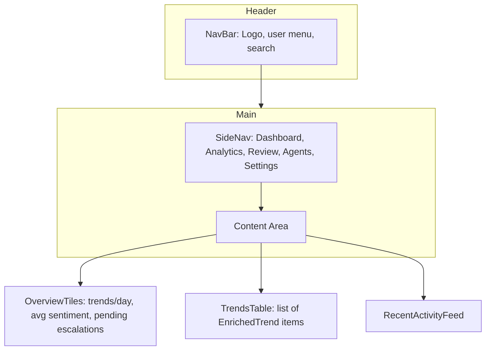
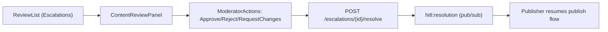
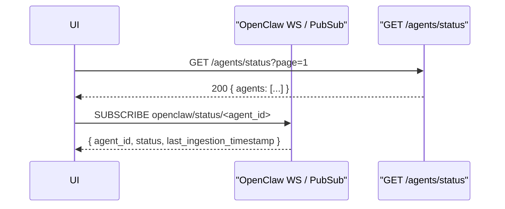

# Frontend Specification — Project Chimera

Purpose: complete frontend spec describing UI components, wireframes, user flows, accessibility requirements, and explicit mappings from UI fields/actions to backend API contracts and data-model fields. This spec is written to be sufficiently prescriptive for an autonomous agent to scaffold a frontend (routes, components, data contracts, test hooks) and integrate with backend services.

---

## 1. Component Hierarchy
Top-level pages and major UI components (React/Vue-style components suggested):

- App (root)
  - NavBar
  - SideNav
  - Router
  - Pages
    - DashboardPage
      - OverviewTiles (KPIs)
      - TrendsTable (paginated)
      - RecentActivityFeed
      - QuickIngestForm (POST /ingest)
    - AnalyticsPage
      - TimeSeriesChart (trend counts, sentiment over time)
      - FiltersPanel (date range, source, domain tags)
      - ExportControls (CSV, JSON)
    - ContentReviewPage (HITL)
      - ReviewList (list of escalations)
      - ContentReviewPanel (selected escalation details)
      - ModeratorActions (approve/reject/request changes)
      - AuditTimeline (ProvenanceLog entries)
    - AgentMonitoringPage
      - AgentList (agent_id, status badge)
      - AgentDetail (OpenClaw status, last_ingestion_timestamp, capacity_score)
      - LiveStatusStream (websocket/subscribe to `openclaw/status/<agent_id>`)
    - PublishConsole
      - ComposePanel
      - PendingPublishList
      - PublishHistory
    - SettingsPage
      - HITLConfigForm (thresholds, notification hooks)
      - Integrations (Weaviate, Redis, DB settings)

Component props & events guidance (examples):
- `TrendsTable` props: `{ page, perPage, filters }` events: `onSelect(trendId)`, `onRefresh()`
- `ContentReviewPanel` props: `{ escalationId }` events: `onResolve({action, notes})`, `onRequestChanges()`

State & data layer:
- Prefer central store (Redux/Vuex/Pinia) for authenticated user, feature flags, and global thresholds (`HITL_CONFIDENCE_THRESHOLD`).
- Use per-component data hooks for remote data; use SWR/React-Query style caching for queries.

---

## 2. Wireframes (Mermaid)

Dashboard layout (two-column):

HITL review flow (list → detail → resolve):

Agent Monitoring Console (status stream):

---

## 3. User Flows
Describe step-by-step flows for primary user types.

A. Network Operator
- Goal: set campaign goals, monitor system health.
- Steps:
  1. Login (Auth handled by existing auth layer).
  2. Navigate to `Dashboard` → view `OverviewTiles` and `TrendsTable`.
  3. Click `Create Campaign` (if present) → open campaign modal (maps to internal campaign API).
  4. Open `AgentMonitoring` → subscribe to agent statuses; use `AgentDetail` to inspect `last_ingestion_timestamp` and `capacity_score`.
  5. Export analytics data via `ExportControls` → triggers `GET /trends/analytics?range=...&format=csv`.

B. HITL Moderator
- Goal: review escalated content and resolve approvals.
- Steps:
  1. Login, open `ContentReviewPage`.
  2. `ReviewList` displays rows from `GET /escalations?status=open` (paginated).
  3. Select an escalation → `ContentReviewPanel` fetches details: `GET /escalations/{id}` including `enriched_trend` payload and `ProvenanceLog` entries.
  4. Optionally run semantic search (Weaviate-backed) to see related content: call `GET /semantic/recall?query=<text>`.
  5. Choose action: Approve / Reject / Request changes. UI calls `POST /escalations/{id}/resolve` with `{ action, resolved_by, notes }`.
  6. On success, UI displays audit entry and the backend emits `hitl:resolution` so `PublishConsole` can resume.

C. Developer
- Goal: configure MCP servers, debug integrations.
- Steps:
  1. Open `SettingsPage` → view integration statuses from `/integrations/status`.
  2. Use `Logs` (link to centralized logs) to inspect recent ingestion/worker errors.
  3. Edit HITL thresholds in `HITLConfigForm` → saves via `PUT /settings/hitl`.
  4. Run tests via a developer panel invoking CI hooks or local commands.

---

## 4. Accessibility Standards
- Responsive design: all screens must be responsive down to 320px width. Use mobile-first layout. Critical flows (review action) must be usable on mobile.
- Keyboard navigation: all interactive elements must be reachable by keyboard (tab order), and actions usable via Enter/Space.
- ARIA: supply ARIA roles and labels for dynamic regions: `role="region" aria-label="Content review panel"`, buttons with `aria-pressed` for toggle state, list items with `role="listitem"`.
- Color contrast: ensure WCAG AA contrast ratio >= 4.5:1 for text and 3:1 for large text.
- Focus indicators: visible focus ring for clickable elements; do not rely on color alone.
- Semantics: use native elements where possible (button, form, table) and provide `aria-live="polite"` for activity feed updates.
- Screen reader flows: content review panel must expose a summary `aria-labelledby` and provide an `aria-describedby` with provenance summary.

Accessibility testing:
- Include automated axe-core tests in CI for critical pages: Dashboard, ContentReviewPage, AgentMonitoringPage.

---

## 5. Explicit Linkage: UI → Backend Contracts & Data Model
Map screens and actions to API endpoints, request/response fields, and data-model fields.

- DashboardPage
  - Source: `GET /trends?page=X&perPage=Y&filters=...` → returns list of `EnrichedTrend` objects: map to data-model fields `id`, `external_id`, `text`, `sentiment`, `topics`, `created_at`, `embedding_status`.
  - Quick ingest: `POST /ingest` (see [specs/002-trend-ingestion/contracts/ingestion-openapi.yaml](specs/002-trend-ingestion/contracts/ingestion-openapi.yaml)). Request fields: `external_id`, `source`, `text`, `timestamp`, `metadata`.

- AnalyticsPage
  - `GET /trends/analytics?range=...&group_by=...` → returns aggregated metrics (time-series); backend uses PostgreSQL aggregation queries and Weaviate similarity counts where needed.

- ContentReviewPage (HITL)
  - List escalations: `GET /escalations?status=open&page=1` → Escalation record fields (`id`, `enriched_trend_id`, `issue_type`, `metrics`, `status`, `created_at`).
  - Escalation detail: `GET /escalations/{id}` → includes `EnrichedTrend` payload and `ProvenanceLog` entries from `ProvenanceLog` table.
  - Resolve escalation: `POST /escalations/{id}/resolve` → body `{ action, resolved_by, notes }` maps to DB fields `status`, `resolved_by`, `resolved_at`, `resolution_reason`. On success backend emits `hitl:resolution` event.

- PublishConsole
  - Publish action: `POST /publish` or `POST /reply` → body references `enriched_trend_id`. Backend validates `Escalation` state; if open, returns `409` (HITL_PENDING).

- AgentMonitoringPage
  - Agent list: `GET /agents/status` → each agent maps to published fields defined in `specs/openclaw_integration.md`: `agent_id`, `status`, `last_ingestion_timestamp`, `capacity_score`.
  - Live updates: subscribe to `openclaw/status/<agent_id>` via websocket or pubsub adapter.

- Semantic recall and similarity
  - `GET /semantic/recall?query=<text>&k=10` → queries Weaviate; maps to `EmbeddingRecord.vector_id` and returns `enriched_trend_id` references and similarity scores.

Data-model field references for UI fields:
- `enriched_trend.id` → internal id used in routes `/trends/{id}`, `/escalations?enriched_trend_id=`.
- `enriched_trend.text` → displayed in TrendsTable and ContentReviewPanel.
- `enriched_trend.embedding_status` → shown as status badge and used to surface embedding pipeline progress.
- `provenance_log.*` → shown in AuditTimeline.

---

## 6. Implementation Details (for an autonomous agent)
- Routes (example):
  - `/` → DashboardPage
  - `/analytics` → AnalyticsPage
  - `/review` → ContentReviewPage
  - `/agents` → AgentMonitoringPage
  - `/publish` → PublishConsole
  - `/settings` → SettingsPage

- Data fetching patterns:
  - Critical lists: server-side pagination with cursor-based pagination preferred. Provide `next_cursor` in response.
  - Long polling vs websockets: use websockets for OpenClaw status and optionally for `judge:escalations` activity; use server-sent events if websockets unavailable.

- Security & auth:
  - All endpoints require authentication and role-based authorization. UI must include role-aware features (e.g., `Moderator` role sees Approve/Reject buttons).
  - Use CSRF protections for browser POSTs; use bearer tokens for service-to-service calls.

- Tests & QA hooks:
  - Provide E2E test IDs in component props (`data-testid="trends-table-row-<id>"`) for Playwright/Cypress.
  - Provide mock server adapters in dev environment that replay sample OpenAPI responses.

---

## 7. Acceptance Criteria for Frontend
- All major screens implemented and wired to backend contracts in `specs/`.
- HITL flows block publishing until escalation resolved, with clear UX messaging and audit trail.
- Accessibility automated checks (axe) pass on critical flows.
- Agent monitoring shows live status updates and links back to provenance for each agent.

---

## 8. Design assets & mockups
- Wireframes above (Mermaid) provide layout. For pixel mocks, link to Figma files (if available) in `specs/_meta.md` or `research/`.

---

## 9. Traceability checklist (for reviewers)
- Does every interactive field map to an API field or data-model field? (Yes/No, list exceptions)
- Are all publish actions gated by escalation checks? (Yes/No)
- Are accessibility rules applied to critical flows? (Yes/No)
- Are live-update channels documented and testable? (Yes/No)

---

Generated: frontend specification for Project Chimera. Place implementation tasks and E2E test stubs under `src/frontend/` and `tests/e2e/` as next steps.
